# 🚀 Z-Flux — AI Finance Super App

## 1. Description
Z-Flux is a comprehensive AI-powered Finance Super App designed to unify the fragmented landscape of personal finance. By integrating budgeting, multi-wallet management, and secure peer-to-peer transfers into a single ecosystem, Z-Flux bridges the gap between passive tracking and active execution. Powered by an intelligent AI layer, it transforms raw financial data into proactive, actionable insights for students and professionals alike.

---

## 2. Problem
- **Fragmented Tools**: Users juggle multiple apps for budgeting, wallets, and transfers, leading to data silos and cognitive load.
- **Passive Tracking Only**: Most tools only record what happened, offering no way to move money or execute transactions.
- **Static Insights**: Current apps provide generic advice that lacks the context of a user's real-time financial situation.
- **Lack of Action**: Information without execution is useless; most apps don't allow users to act on their financial insights.

---

## 3. Solution
Z-Flux provides a unified "Command Center" for your money. It combines a robust transaction engine with a multi-wallet system and a real-time AI Decision Engine. This synergy allows users to not only track spending but also move funds and receive context-aware guidance that improves their financial health instantly.

---

## 4. Features

### 💰 Core Finance
- **Transactions**: Automated tracking and manual entry with deep categorization.
- **Budgeting**: Smart limits across categories with real-time progress alerts.
- **Wallets**: Manage multiple accounts (Savings, Daily, Business) in one place.
- **Transfers**: Secure wallet-to-wallet and peer-to-peer fund movements.

### 🤖 AI Layer
- **AI Insights**: Deep analysis of spending patterns and financial health.
- **AI Recommendations**: Actionable suggestions based on real-time behavior.
- **AI Smart Plans**: Personalized financial roadmaps to reach your goals.
- **AI Advisor**: A context-aware chatbot for instant financial guidance and decision support.

### 👥 Social Layer
- **Friends**: Connect with others to simplify shared financial activities.
- **Peer transfers**: Send and receive money instantly within your social circle.
- **Group insights**: Shared transparency for group ledgers and collective goals.

---

## 5. Screenshots (VERY IMPORTANT)

<div align="center">
  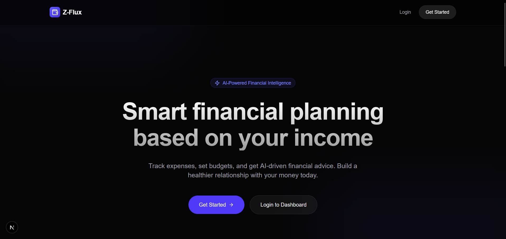
  <p><em>Modern Landing Page — The gateway to your financial ecosystem</em></p>
  <br/>
  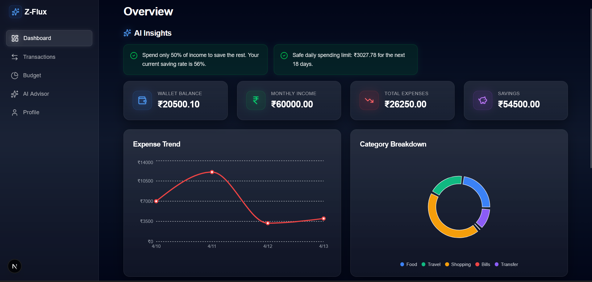
  <p><em>Financial Overview — At-a-glance health and balance tracking</em></p>
  <br/>
  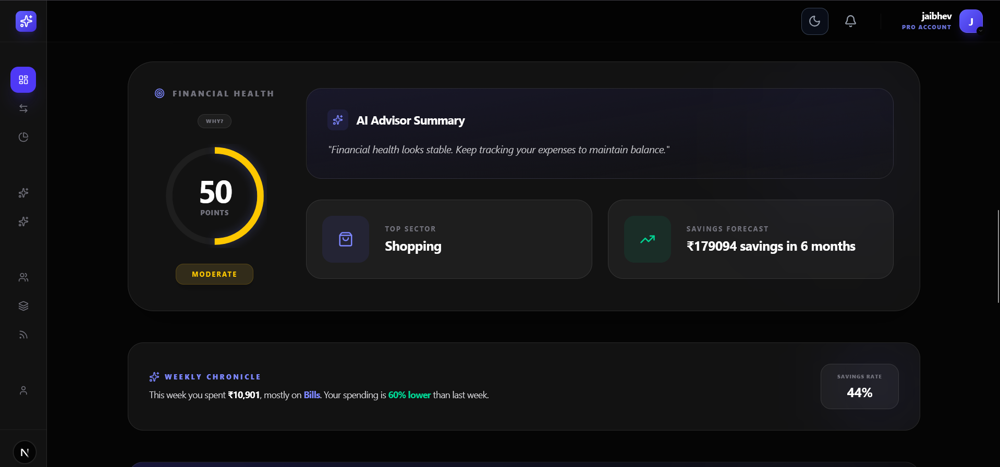
  <p><em>Extended Analytics — Deep dive into your spending and income trends</em></p>
  <br/>
  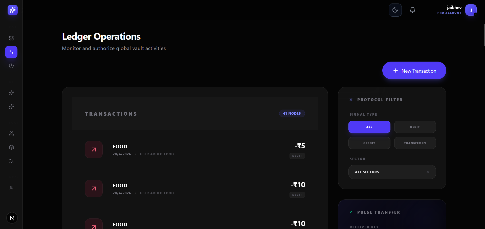
  <p><em>Transaction Management — Clean, sortable history of every rupee</em></p>
  <br/>
  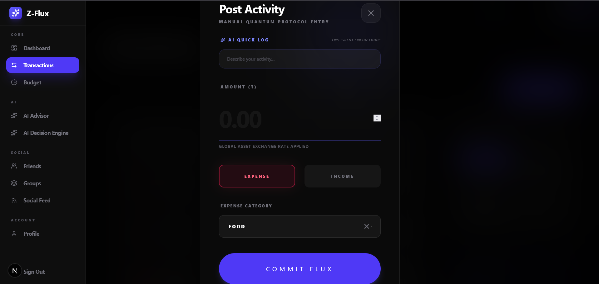
  <p><em>Detailed Insights — Granular breakdown of individual expenses</em></p>
  <br/>
  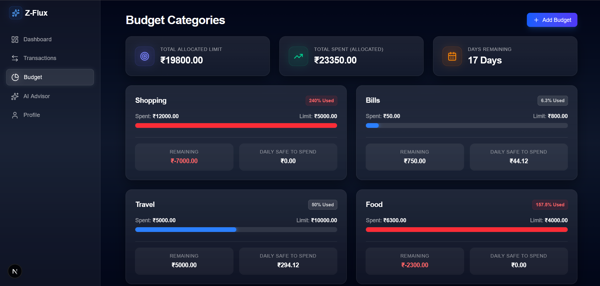
  <p><em>Smart Budgeting — Set limits and track progress with visual cues</em></p>
  <br/>
  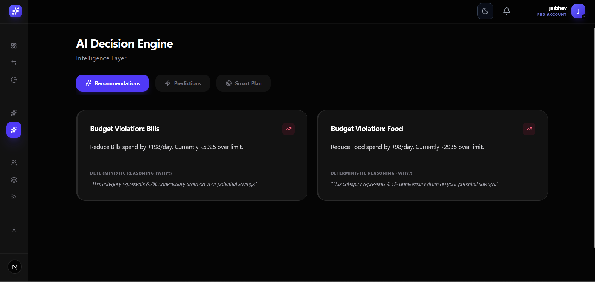
  <p><em>AI Decision Engine — Data-driven logic solving your financial puzzles</em></p>
  <br/>
  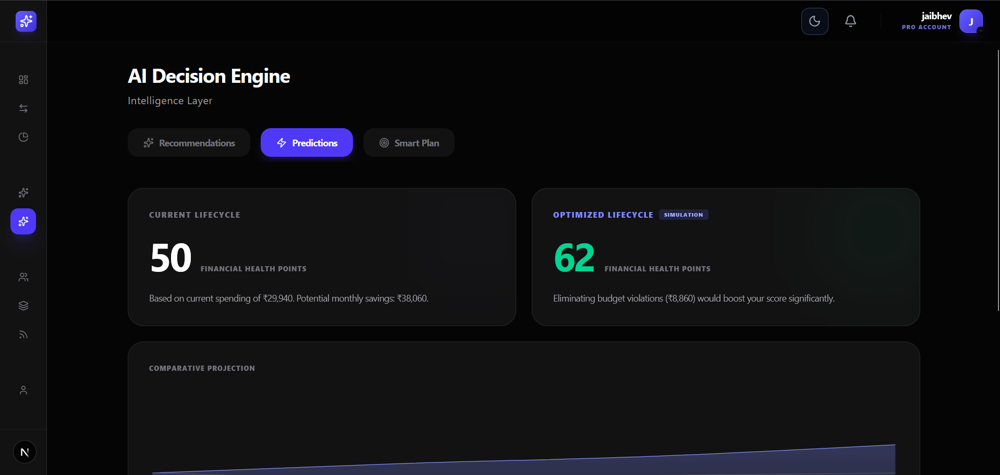
  <p><em>Future Predictions — AI-powered forecasting for better planning</em></p>
  <br/>
  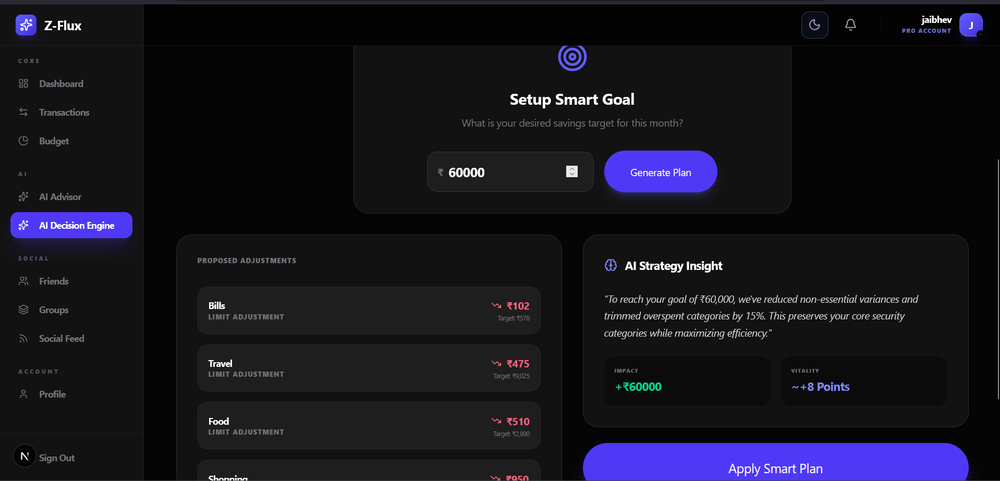
  <p><em>AI Smart Plan — Personalized roadmaps to achieve financial goals</em></p>
  <br/>
  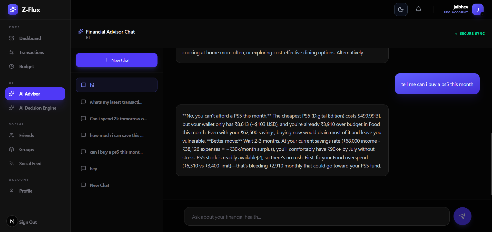
  <p><em>AI Advisor — Real-time chat for on-the-go financial advice</em></p>
  <br/>
  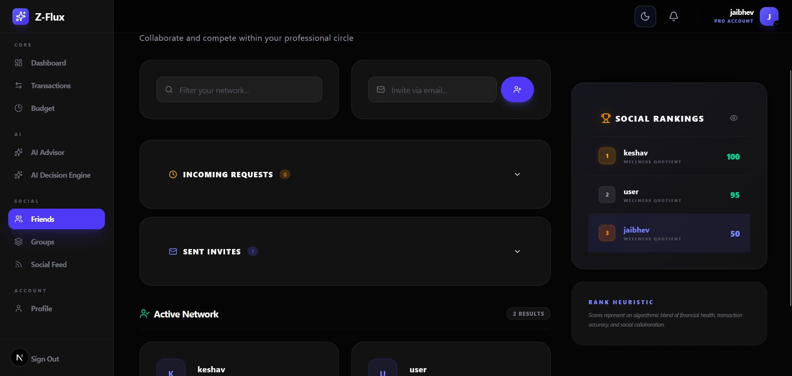
  <p><em>Social Connections — Finance is better with friends</em></p>
  <br/>
  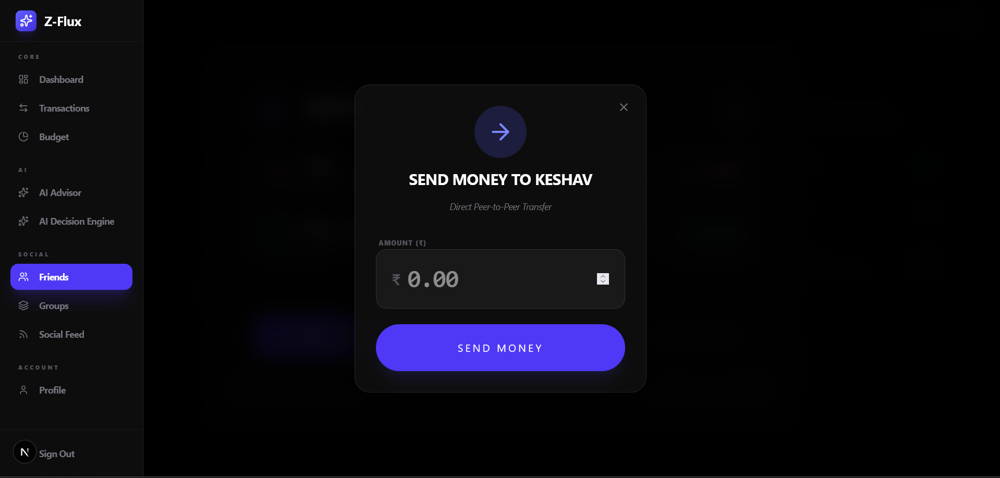
  <p><em>Peer Transfers — Instant, secure money movement between users</em></p>
  <br/>
  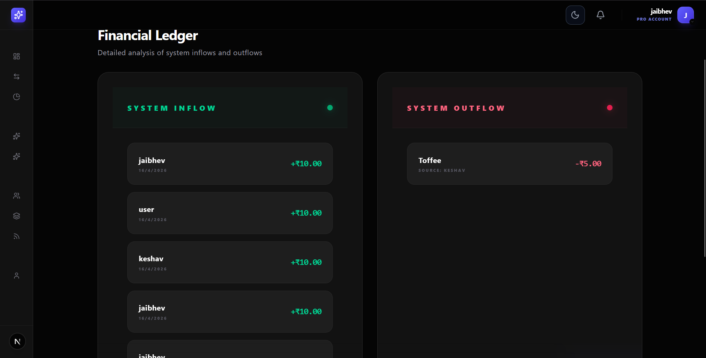
  <p><em>Group Ledger — Collaborative tracking for shared expenses</em></p>
  <br/>
  
  <p><em>User Profile — Personalize your experience and security</em></p>
</div>

---

## 6. Tech Stack

| Layer | Technology |
| :--- | :--- |
| **Frontend** | Next.js 15+, React 19, Tailwind CSS 4, Capacitor |
| **Backend** | Next.js API Routes, Prisma ORM |
| **Database** | PostgreSQL |
| **AI** | OpenRouter (Minimax M2.5 / OpenAI) |

---

## 7. Installation

```bash
# Clone the repository
git clone https://github.com/your-username/z-flux.git

# Install dependencies
npm install

# Run the development server
npm run dev
```

---

## 8. Usage
1. **Run App**: Launch the dev server and navigate to `localhost:3000`.
2. **Setup Wallets**: Create your primary wallets and add initial transactions.
3. **Analyze**: Visit the **AI Advisor** or **Decision Engine** to get personalized insights.
4. **Social**: Connect with friends to start secure peer transfers.

---

## 9. Why Z-Flux
- **Unified System**: Eliminates the need for 5+ apps by merging finance and social silos.
- **Actionable AI**: Doesn't just track; it advises, predicts, and helps execute.
- **Social Finance Layer**: Makes money management collaborative and transparent.
- **Real-time Decision Engine**: Processes data instantly for immediate financial impact.

---

## 10. License
MIT License. © 2026 Z-Flux Team.